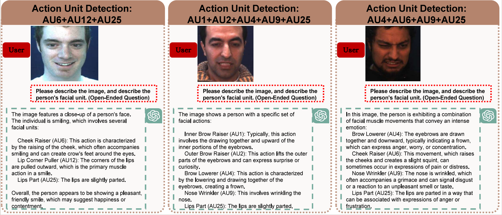

# GPT4Affectivity


[](https://arxiv.org/abs/2311.05332)


This is the official repository for the technical report: 

**GPT as Psychologist? Preliminary Evaluations for GPT-4V on Visual Affective Computing**.


## 📌 Introduction

This paper assesses the application of MLMs with 5 crucial abilities for affective computing, spanning from visual affective tasks and reasoning tasks. The results show that GPT4 has high accuracy in facial action unit recognition and micro-expression detection while its general facial expression recognition performance is not accurate. We also highlight the challenges of achieving fine-grained micro-expression recognition and the potential for further study and demonstrate the versatility and potential of GPT4 for handling advanced tasks in emotion recognition and related fields by integrating with task-related agents for more complex tasks, such as heart rate estimation through signal processing. In conclusion, this paper provides valuable insights into the potential applications and challenges of MLMs in human-centric computing. 


## 🚀 Usage

We have provided many interesting examples of different affective computing tasks.


## 🖼 Illustrations

Here are some interesting findings from our report:

- **Accurate action unit recognition**: GPT-4V is very accurate for recognizing facial action units.
  
  


- **Inaccurate emotion recognition**: GPT-4V is very inaccurate for subjective expressions.

  
  

- **Tool call and self-correction**: GPT-4V can invoke tools and self-correct errors.

  


## 📜 Citation

If our repository accelerates your research, please use the following citation:

```bibtex
@article{lu2024gpt,
      title={GPT as Psychologist? Preliminary Evaluations for GPT-4V on Visual Affective Computing}, 
      author={Hao Lu and Xuesong Niu and Jiyao Wang and Yin Wang and Qingyong Hu and Jiaqi Tang and Yuting Zhang and Kaishen Yuan and Bin Huang and Zitong Yu and Dengbo He and Shuiguang Deng and Hao Chen and Yingcong Chen and Shiguang Shan},
      year={2024},
      journal={arXiv preprint arXiv:2403.05916},
}
```
